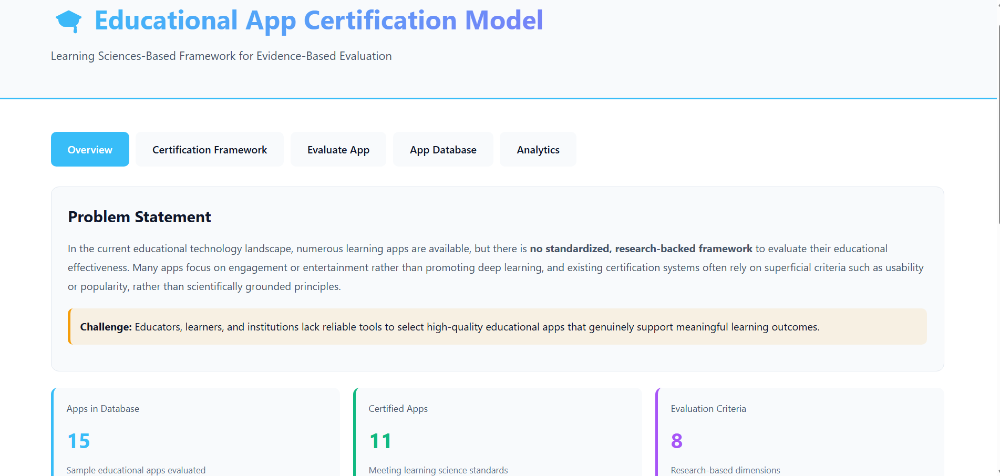
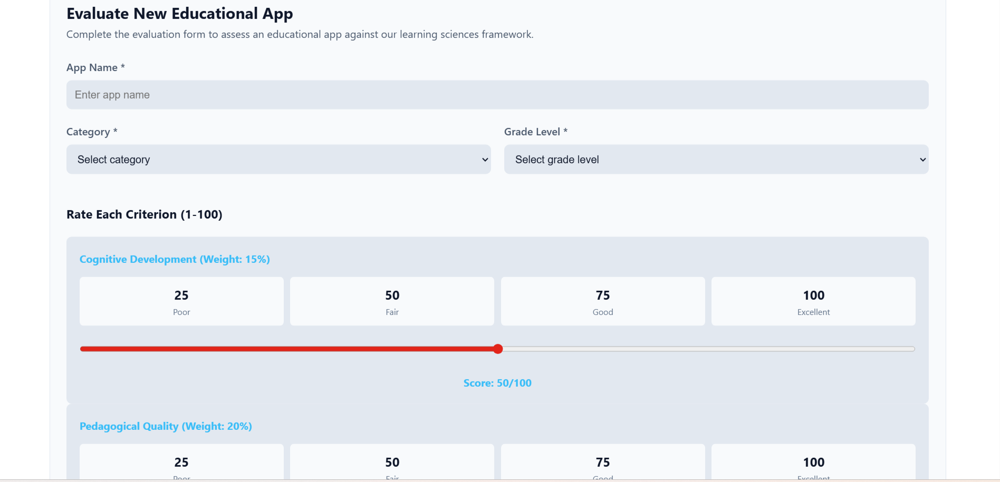
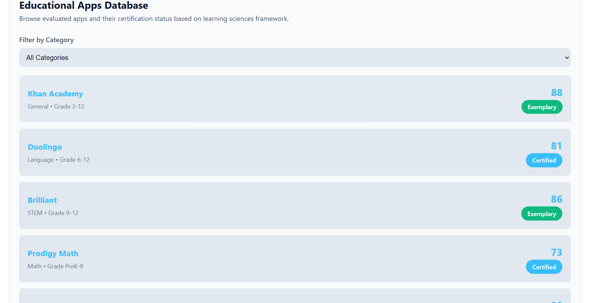
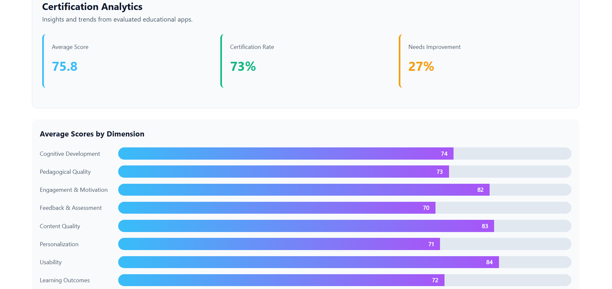

# 🎓 Educational App Certification Model

## 📌 Overview

The **Educational App Certification Model** is a web-based platform designed to evaluate educational applications using a research-based framework built on Learning Sciences.

It helps students, teachers, and institutions identify high-quality learning apps based on real learning outcomes.

---

## ❗ Problem Statement

There are many educational apps available, but there is **no standardized, research-backed system** to evaluate their effectiveness.

This creates confusion when choosing the best app for learning.

---

## 💡 Solution

This project introduces an **8-dimensional evaluation framework** that analyzes educational apps and provides certification based on their quality and effectiveness.

---

## 🚀 Features

* 📊 8-Dimensional Evaluation Framework
* 🧠 Cognitive & Pedagogical Analysis
* 📈 Score-Based Certification
* 🗂️ Educational App Database
* 📊 Analytics Dashboard
* 🎯 Real-time Evaluation System

---

## 🖥️ Screenshots

### 🔹 Home Page

### 🔹 Evaluation System

### 🔹 App Database

### 🔹 Analytics Dashboard

---

## 🛠️ Technologies Used

* HTML
* CSS
* JavaScript

---

## ⚙️ How It Works

1. Enter or select an educational app
2. Evaluate it using multiple criteria
3. System calculates weighted score
4. Certification level is generated
5. Results are displayed with analytics

---

## 🏆 Certification Levels

* 🥇 Exemplary (85–100)
* ⭐ Certified (70–84)
* 📋 Conditional (55–69)
* ⚠️ Not Recommended (<55)

---

## 🌐 Live Demo

[Click here to open project](https://imbadshahkhann.github.io/Educational-App-Certification-Model/)

---

## 📂 GitHub Repository

[Click here to view code](https://github.com/imbadshahkhann/Educational-App-Certification-Model)

---

## 👨‍💻 Team Members

* Badshah Khan
* Shashank Sendil
* Rakshit Bhutani
* Abhishek

---

## 📌 Future Improvements

* AI-based evaluation system
* Real-time integration
* User authentication
* Cloud storage

---

## 📜 License

This project is created for educational purposes.
